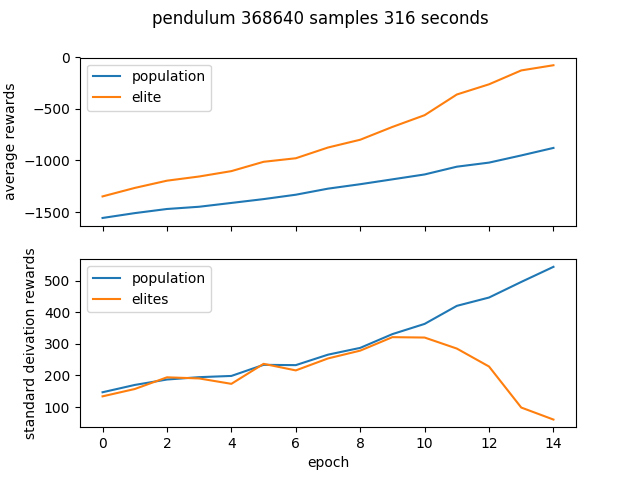

# Cross Entropy Method

Cross Entropy Method (CEM) is a gradient free optimization algorithm that fits parameters by iteratively resampling from an elite population.  

The model learns only from a single scalar (total episode reward).

Pseudocode for the CEM algorithm:

```python
for epoch in num_epochs:
  sampling a population from a distribution
  testing that population using the environment
  selecting the elites (judged by total episode reward)
  refitting the sampling distribution (to the elites)
```


CEM can be easily parallelized - this implementation runs batches across multiple processes using Python's `multiprocessing`, making it quick in wall time.

The total number of episodes run in an experiment is given by:

```python
num_episodes = num_epochs * num_processes * batch_size
```

## Use

### Cartpole

```shell-session
$ python cem.py cartpole --num_process 6 --epochs 8 --batch_size 4096
Namespace(env='cartpole', num_process=6, epochs=8, batch_size=4096)
expt of 196608 total episodes
epoch 0 - 22.0 30.5 pop - 64.9 48.1 elites
epoch 1 - 33.3 37.4 pop - 92.9 46.2 elites
epoch 2 - 46.0 46.9 pop - 125.1 46.9 elites
```


### Pendulum

```shell-session
$ python cem.py pendulum --num_process 6 --epochs 15 --batch_size 4096
```




## Setup

The dependencies of this project are `gym` and `matplotlib` - `numpy` will come along with `gym`:

```bash
$ pip install -r requirements.txt
```
