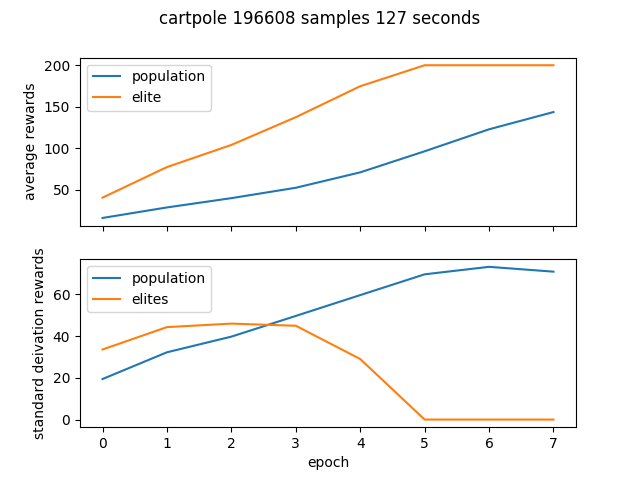
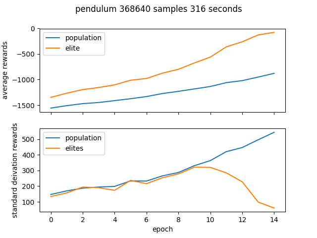

Cross entropy method (CEM) is a optimization algorithm that fits parameters by:
- sampling a population from a distribution
- testing that population using the environment
- selecting the elites, judged by total episoe reward
- refitting the sampling distribution
- repeat

CEM is easily parallelizable - this implementation parallelizes large batches across multiple processes, making it very efficient in clock time.

The total number of episodes run in an experiment is given by:

```python
num_episoes = num_epochs * num_processes * batch_size
```

## Setup

```bash
$ git clone

$ cd cem

$ pip install -r requirements.txt
```

The two dependencies of this project are Open AI gym and matplotlib.

## Usage and results

## Cartpole 
```bash
$ python cem.py cartpole --num_process 6 --epochs 8 --batch_size 4096
```



## Pendulum 

```bash
$ python cem.py pendulum --num_process 6 --epochs 15 --batch_size 4096
```


